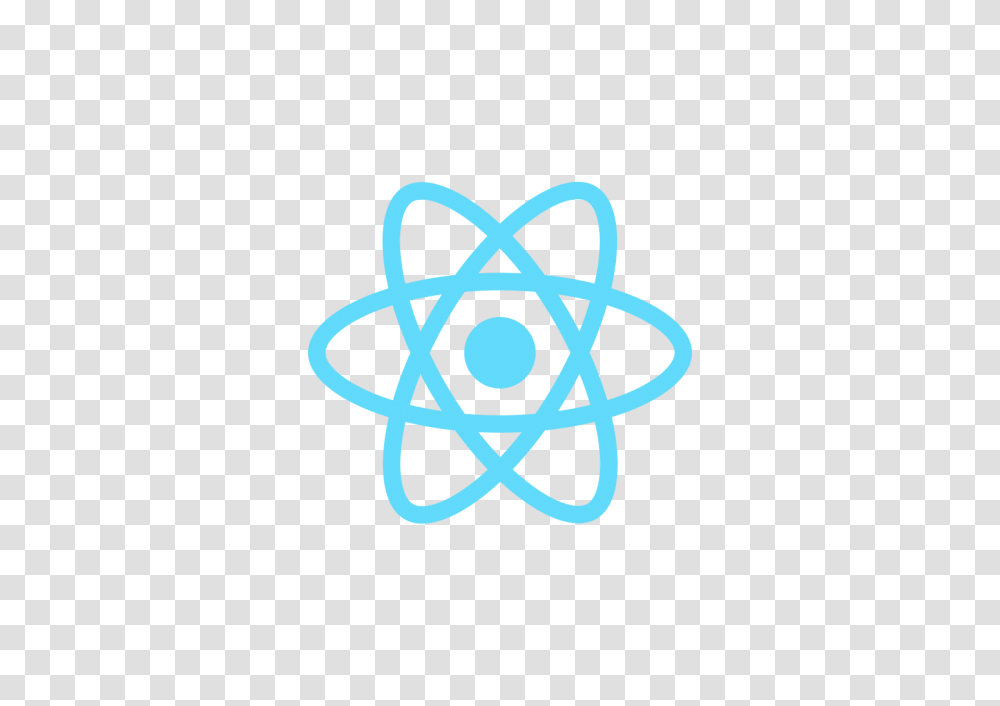

  

<h1 align="center" > Projeto Qodeless Ask </h1>  

Esse é um projeto de estudo do framework REACT, utilizando a ideia de criar um site onde voce consiga criar perguntas para serem respondidas.

<h1 align="center" > 🧪 Tecnologias Utilizadas </h1>

* REACT
* FIREBASE
* CSS
* HTML
* TYPESCRIPT

<h1 align="center">Link do Site</h1> 
https://projeto-pg2z96s47-guilhermebernava.vercel.app/
